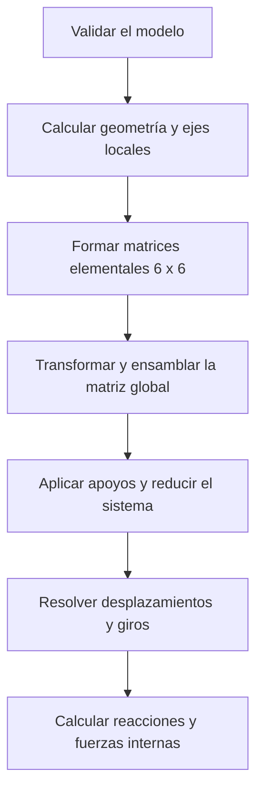

# Pórticos 2D

Calculadora web para el análisis matricial de pórticos planos mediante el **Método de la Rigidez Directa**.

[](https://calc-estructural-2-d.vercel.app/)
[](https://www.typescriptlang.org/)
[](https://astro.build/)
[](https://react.dev/)
[](LICENSE)

> Proyecto académico desarrollado por **Lizbeth Villafuerte**, estudiante de Ingeniería Mecánica de la Universidad Técnica de Ambato.

## Descripción

Pórticos 2D permite definir una estructura desde el navegador y obtener su respuesta estática sin instalar programas adicionales. El usuario introduce los nodos, las barras, los apoyos y las cargas. La aplicación ensambla el sistema global, aplica las restricciones y resuelve los desplazamientos desconocidos.

El resultado no se presenta como una caja negra. Además de la deformada, la plataforma muestra las matrices utilizadas durante el procedimiento. Esto facilita la revisión de ejercicios resueltos a mano y permite identificar con claridad de dónde sale cada valor.

### Accesos

- **Página principal:** [calc-estructural-2-d.vercel.app](https://porticolab-js84.vercel.app/)
- **Calculadora:** [calc-estructural-2-d.vercel.app/calculadora](https://porticolab-js84.vercel.app/)
- **Repositorio:** [Lizbeth Villafuerte/CalcEstructural-2D](https://github.com/lizmonse/porticolab.git)

## ¿Qué calcula?

La aplicación entrega los resultados principales de un análisis lineal de pórticos planos:

- matriz de rigidez local de cada barra;
- matriz de transformación de coordenadas;
- matriz de rigidez global ensamblada;
- sistema reducido después de aplicar los apoyos;
- desplazamientos horizontales y verticales de los nodos;
- giros nodales;
- reacciones horizontales, verticales y de momento;
- fuerza axial, cortante y momento flector en los extremos de cada barra;
- geometría original y forma deformada;
- diagramas de fuerza axial, cortante y momento flector;
- reporte en formato PDF.

En un pórtico plano, cada nodo tiene tres grados de libertad:

$$
\{d_i\}=\begin{bmatrix}u_i & v_i & \theta_{z,i}\end{bmatrix}^{T}
$$

Por esta razón, una barra de dos nodos tiene seis grados de libertad y una matriz elemental de $6\times6$.

## Guía rápida de uso

### 1. Abrir la calculadora

Ingrese a la [página principal](https://calc-estructural-2-d.vercel.app/) y seleccione **Abrir calculadora**. También puede entrar directamente desde el enlace de la calculadora.

La plataforma inicia con un ejercicio resuelto. Lo más recomendable es revisar primero ese modelo. Así podrá reconocer las tablas, la estructura dibujada y la forma en que se presentan los resultados.

### 2. Revisar el ejercicio de ejemplo

El ejemplo precargado corresponde a un **pórtico con voladizo**. Tiene cinco nodos, cuatro elementos, una carga nodal y dos cargas distribuidas.

No hace falta escribir nada para observarlo. Revise la geometría, cambie entre los diagramas y seleccione cada barra en la tabla de resultados. Si modifica un dato, la plataforma avisará que existen cambios pendientes. Pulse **Resolver estructura** para actualizar el cálculo.

El botón **Restablecer ejemplo** recupera el modelo original. Esta opción es útil si desea repetir la práctica desde el comienzo.

### 3. Crear un modelo nuevo

Pulse **Limpiar todo**. La calculadora dejará vacías las tablas de nodos, elementos y cargas.

Se recomienda ingresar la información en este orden:

1. nodos y coordenadas;
2. restricciones de los apoyos;
3. cargas aplicadas en los nodos;
4. elementos y propiedades de sección;
5. cargas distribuidas en las barras;
6. resolución y revisión de resultados.

Este orden evita referencias a nodos o elementos que todavía no existen.

## Ingreso de datos

### Nodos, cargas y apoyos

Pulse **Agregar nodo** y complete una fila por cada punto de conexión de la estructura.

| Campo | Descripción | Unidad |
|---|---|---:|
| `x` | Coordenada horizontal | m |
| `y` | Coordenada vertical | m |
| `Fx` | Fuerza nodal horizontal | kN |
| `Fy` | Fuerza nodal vertical | kN |
| `Mz` | Momento aplicado alrededor del eje z | kN·m |
| `ux = 0` | Restringe el desplazamiento horizontal | — |
| `uy = 0` | Restringe el desplazamiento vertical | — |
| `θz = 0` | Restringe el giro del nodo | — |

Convención utilizada por la interfaz:

- `Fx` es positiva hacia la derecha;
- `Fy` es positiva hacia arriba;
- `Mz` es positivo en sentido antihorario.

#### Configuración de apoyos

| Tipo de apoyo | `ux = 0` | `uy = 0` | `θz = 0` |
|---|:---:|:---:|:---:|
| Empotramiento | ✓ | ✓ | ✓ |
| Articulación | ✓ | ✓ |  |
| Apoyo móvil horizontal |  | ✓ |  |
| Apoyo móvil vertical | ✓ |  |  |
| Nodo libre |  |  |  |

Antes de resolver, compruebe que la estructura tenga suficientes restricciones. Si el modelo forma un mecanismo, la aplicación lo indicará y detendrá el cálculo.

### Elementos, material y sección

Pulse **Agregar elemento**. Después seleccione el nodo inicial `i`, el nodo final `j` y escriba las propiedades de la barra.

| Campo | Descripción | Unidad de la interfaz |
|---|---|---:|
| `Nodo i` | Extremo inicial de la barra | — |
| `Nodo j` | Extremo final de la barra | — |
| `L` | Longitud calculada con las coordenadas | m |
| `E` | Módulo de elasticidad | GPa |
| `A` | Área de la sección transversal | mm² |
| `I` | Momento de inercia para la flexión en el plano | cm⁴ |

El orden de los nodos `i` y `j` define los ejes locales utilizados para reportar las fuerzas de extremo. Sin embargo, invertir ese orden no debe cambiar la respuesta física de la estructura.

> **Cuidado con las unidades:** un error de escala en `A` o `I` puede producir deformaciones muy alejadas de lo esperado. Como referencia, la interfaz muestra valores típicos de un perfil IPE 300: `A = 5380 mm²` e `I = 8356 cm⁴`.

### Cargas distribuidas en barra

Pulse **Agregar carga** y seleccione el elemento sobre el que actuará. La intensidad se define en los extremos `i` y `j` mediante las componentes globales `wx` y `wy`.

| Campo | Descripción | Unidad |
|---|---|---:|
| `wx en i` | Componente horizontal en el extremo inicial | kN/m |
| `wy en i` | Componente vertical en el extremo inicial | kN/m |
| `wx en j` | Componente horizontal en el extremo final | kN/m |
| `wy en j` | Componente vertical en el extremo final | kN/m |

- Para una carga **uniforme**, escriba la misma intensidad en ambos extremos.
- Para una carga **triangular**, escriba cero en un extremo y la intensidad máxima en el otro.
- Para una carga **trapezoidal**, utilice intensidades diferentes de cero en `i` y `j`.
- El peso propio o una carga vertical descendente se ingresa con `wy` negativa.

Las componentes son globales. Esto significa que una carga vertical conserva la dirección global `y`, aunque la barra sea inclinada.

## Resolver la estructura

Cuando el modelo esté completo, pulse **Resolver estructura**. También puede utilizar el atajo `Ctrl + Enter`.

La calculadora valida los datos antes de resolver. Si encuentra una barra sin longitud, una referencia inexistente, propiedades no válidas o una estructura inestable, mostrará un mensaje en lugar de entregar resultados incorrectos.

El procedimiento interno sigue esta secuencia:



En forma resumida, el sistema libre se resuelve mediante:

$$
[K_{ff}]\{d_f\}=\{F_f\}
$$

## Lectura de resultados

### Visualización de la estructura

La parte gráfica ofrece cinco vistas:

| Vista | Información mostrada |
|---|---|
| **Geometría** | Nodos, barras, apoyos y cargas del modelo original |
| **Deformada** | Forma desplazada de la estructura, con amplificación visual |
| **Axial (N)** | Estado y diagrama de fuerza axial |
| **Cortante (V)** | Diagrama de fuerza cortante |
| **Momento (M)** | Diagrama de momento flector |

La deformada está amplificada para que pueda verse con facilidad. No debe interpretarse como una representación a escala real sin revisar primero los desplazamientos numéricos.

En la vista axial, el color azul identifica tracción, el naranja compresión y el gris una fuerza axial nula o cercana a cero.

### Resultados nodales

La tabla presenta:

- `ux`: desplazamiento horizontal en metros;
- `uy`: desplazamiento vertical en metros;
- `θz`: giro en radianes;
- `Rx`: reacción horizontal en kN;
- `Ry`: reacción vertical en kN;
- `Mz`: momento de reacción en kN·m.

Los nodos libres no tienen reacciones. Por eso esas celdas aparecen vacías. En una articulación, el giro está permitido y la reacción de momento es igual a cero.

### Fuerzas internas por barra

Cada fila muestra la fuerza axial `N`, los cortantes `Vi` y `Vj`, y los momentos `Mi` y `Mj`.

Los valores se entregan en los ejes locales de la barra. La fuerza axial es positiva cuando existe tracción. Los momentos positivos se consideran antihorarios.

Puede seleccionar el identificador de un elemento para revisar con más detalle sus propiedades, sus fuerzas internas y las matrices relacionadas con esa barra.

### Procedimiento matricial

Pulse **Mostrar matrices** para desplegar las matrices elementales, el ensamble global y el sistema reducido. Esta sección resulta útil para comparar el procedimiento del programa con un ejercicio desarrollado a mano.

Si necesita que las matrices aparezcan en el informe, actívelas antes de exportarlo.

### Exportar el reporte

Pulse **Exportar Reporte PDF**. El archivo generado resume:

- identificación del proyecto;
- datos del modelo;
- nodos, apoyos y cargas;
- propiedades de los elementos;
- cargas distribuidas;
- resultados nodales;
- fuerzas internas;
- matrices, cuando fueron habilitadas previamente.

## Comprobación con el ejemplo precargado

Estos datos sirven como una verificación rápida de que el ejemplo inicial fue restaurado y resuelto correctamente.

| Resumen | Valor |
|---|---:|
| Nodos | 5 |
| Elementos | 4 |
| Longitud total | 15.000 m |
| Grados de libertad | 10 libres de 15 |
| Cargas nodales | 1 |
| Cargas distribuidas | 2 |

Reacciones principales del ejemplo:

| Nodo | Rx (kN) | Ry (kN) | Mz (kN·m) |
|---|---:|---:|---:|
| `n1` | -4.754 | 27.16 | 22.81 |
| `n4` | -7.246 | 83.84 | 0 |

Las reacciones horizontales suman `-12 kN`, que equilibran la carga nodal horizontal de `12 kN`. Las reacciones verticales suman `111 kN`, que equilibran las dos cargas repartidas del ejemplo.

## Unidades

La interfaz utiliza unidades habituales de tablas de perfiles. El motor convierte esos valores al sistema consistente antes de resolver.

| Magnitud | Interfaz | Motor |
|---|---:|---:|
| Coordenadas y longitud | m | m |
| Fuerza | kN | kN |
| Momento | kN·m | kN·m |
| Carga distribuida | kN/m | kN/m |
| Módulo de elasticidad `E` | GPa | kN/m² |
| Área `A` | mm² | m² |
| Inercia `I` | cm⁴ | m⁴ |
| Desplazamiento | m | m |
| Giro | rad | rad |

No mezcle unidades dentro de una misma columna. Por ejemplo, un área obtenida en `cm²` debe convertirse a `mm²` antes de ingresarla.

## Fundamento y alcance del motor

Para una estructura con `n` nodos, la matriz de rigidez global tiene un tamaño de `3n × 3n`. Cada elemento aporta una matriz local de `6 × 6`, que considera deformación axial y flexión.

El motor realiza las siguientes operaciones:

1. calcula la longitud y los cosenos directores de cada barra;
2. forma la matriz de rigidez local;
3. transforma cada contribución a coordenadas globales;
4. convierte las cargas distribuidas en acciones nodales equivalentes;
5. ensambla la matriz global y el vector de cargas;
6. aplica las condiciones de apoyo;
7. resuelve el sistema de grados de libertad libres;
8. recupera las reacciones y fuerzas de extremo.

## Validación numérica

El motor se contrasta con casos cuya solución teórica es conocida. Estas verificaciones permiten detectar errores de formulación, ensamble, orientación o unidades.

| Caso | Comprobación principal |
|---|---|
| Ménsula con carga en punta | $\delta=PL^3/3EI$, $\theta=PL^2/2EI$ |
| Ménsula con momento en punta | $\delta=ML^2/2EI$, $\theta=ML/EI$ |
| Viga biapoyada con carga central | $\delta=PL^3/48EI$, $M=PL/4$ |
| Viga biempotrada con carga central | $\delta=PL^3/192EI$, $M=PL/8$ |
| Asiento de apoyo | $M=6EI\Delta/L^2$ |
| Pórtico con carga lateral | Equilibrio global de fuerzas y momentos |
| Rotación rígida del modelo | Invariancia de fuerzas locales y giros |

La suite también comprueba que la respuesta física no dependa del orden de los elementos, de la numeración de los nodos o de la dirección utilizada para definir una barra.

## Tecnologías utilizadas

- [Astro](https://astro.build/) para las páginas y el renderizado estático.
- [React](https://react.dev/) para la calculadora y los componentes interactivos.
- [TypeScript](https://www.typescriptlang.org/) para mantener contratos de datos estrictos.
- [Tailwind CSS](https://tailwindcss.com/) para los estilos de la interfaz.
- [Math.js](https://mathjs.org/) para la resolución numérica del sistema reducido.
- [Vitest](https://vitest.dev/) para las pruebas del motor, las unidades y la visualización.

## Arquitectura

El motor de cálculo está separado de la interfaz. No depende de React ni del DOM, por lo que puede ejecutarse desde el navegador, Node.js o una suite de pruebas.

```text
src/
├─ types/frame.ts             Contratos del modelo estructural
├─ lib/frame/
│  ├─ dof.ts                  Numeración de grados de libertad
│  ├─ geometry.ts             Longitudes y cosenos directores
│  ├─ element.ts              Matriz local, transformación y fuerzas de extremo
│  ├─ assembly.ts             Ensamble del sistema global
│  ├─ solver.ts               Restricciones y resolución del sistema
│  ├─ postprocess.ts          Reacciones y fuerzas internas
│  ├─ validation.ts           Validación física y numérica del modelo
│  └─ index.ts                API pública: solveFrame(model)
├─ hooks/                     Estado reactivo y medición del contenedor
├─ utils/
│  ├─ viewport.ts             Escala del dibujo y deformada cúbica
│  ├─ format.ts               Formato de resultados
│  ├─ units.ts                Etiquetas de unidades
│  ├─ unit-conversion.ts      Conversión entre interfaz y motor
│  ├─ theme.ts                Convención gráfica estructural
│  └─ error-translations.ts   Mensajes de validación en español
├─ components/
│  ├─ site/                   Cabecera y pie de la página principal
│  ├─ ui/                     Componentes reutilizables
│  └─ frame/                  Tablas, paneles, resultados y dibujo SVG
├─ pages/
│  ├─ index.astro             Página principal
│  └─ calculadora.astro       Aplicación de cálculo
└─ data/                      Modelo de ejemplo precargado
```

El código y sus comentarios utilizan inglés para mantener una convención técnica uniforme. La documentación y la interfaz están escritas en español para la audiencia académica del proyecto.

## Uso del motor desde TypeScript

```ts
import { solveFrame } from './src/lib/frame';

const solution = solveFrame({
  nodes: [
    { id: 1, x: 0, y: 0 },
    { id: 2, x: 0, y: 4 },
    { id: 3, x: 6, y: 4 },
    { id: 4, x: 6, y: 0 },
  ],
  elements: [
    { id: 1, from: 1, to: 2, E: 210e6, A: 5.38e-3, I: 8.356e-5 },
    { id: 2, from: 2, to: 3, E: 210e6, A: 5.38e-3, I: 8.356e-5 },
    { id: 3, from: 3, to: 4, E: 210e6, A: 5.38e-3, I: 8.356e-5 },
  ],
  supports: [
    { node: 1, restrainX: true, restrainY: true, restrainRz: true },
    { node: 4, restrainX: true, restrainY: true, restrainRz: true },
  ],
  loads: [{ node: 2, fx: 25, fy: 0, mz: 0 }],
  distributedLoads: [],
});

solution.elements.forEach((element) => {
  const { axialForce, momentI, momentJ } = element.endForces;

  console.log(
    `Barra ${element.elementId}: ` +
      `N = ${axialForce.toFixed(2)} kN, ` +
      `Mi = ${momentI.toFixed(2)} kN·m, ` +
      `Mj = ${momentJ.toFixed(2)} kN·m`,
  );
});
```

En este ejemplo, los valores se envían directamente al motor. Por eso `E`, `A` e `I` ya están expresados en `kN/m²`, `m²` y `m⁴`.

## Instalación y desarrollo

### Requisitos

- Node.js en una versión LTS reciente;
- npm;
- navegador web moderno.

### Ejecutar el proyecto

```bash
git clone https://github.com/DiegoCuaycal/CalcEstructural-2D.git
cd CalcEstructural-2D
npm install
npm run dev
```

### Verificaciones disponibles

```bash
npm test
npm run typecheck
npm run build
```

## Estado del proyecto

| Fase | Descripción | Estado |
|---:|---|:---:|
| 1 | Configuración y arquitectura | Completada |
| 2 | Motor de cálculo | Completada |
| 3 | Interfaz de usuario | Completada |
| 4 | Estado reactivo | Completada |
| 5 | Renderizado gráfico y reportes | Completada |

## Limitaciones conocidas

- El análisis es estático, lineal elástico y de primer orden.
- El modelo es bidimensional y supone uniones rígidas entre las barras.
- No se consideran pandeo, plasticidad, grandes desplazamientos, efectos térmicos ni análisis dinámico.
- Los apoyos inclinados no están implementados.
- Una carga puntual aplicada dentro de una barra debe modelarse mediante un nodo en ese punto.
- Las cargas distribuidas varían linealmente entre los extremos `i` y `j`; no se admiten funciones de carga de orden superior.
- La herramienta calcula la respuesta estructural, pero no realiza diseño o comprobación según una norma de acero u hormigón.
- El modelo de trabajo no se conserva de forma permanente entre sesiones. El reporte PDF sí puede descargarse.

## Recomendaciones de uso

- Dibuje primero la geometría y numere los nodos antes de llenar las tablas.
- Revise las unidades de `E`, `A` e `I`.
- Compruebe el equilibrio global de fuerzas y momentos.
- Observe si la deformada coincide con el comportamiento esperado.
- Compare al menos un resultado con un cálculo manual o un caso conocido.
- Use la aplicación como herramienta académica de comprobación. Para un proyecto real se requiere la revisión de un profesional responsable.

## Licencia

Este proyecto se publica bajo la licencia [MIT](LICENSE).

---

**Pórticos 2D** · Método de la Rigidez Directa · Universidad Técnica de Ambato
